## UNIVERSIDAD DE SAN CARLOS DE GUATEMALA 
## INGENIERÍA EN CIENCIAS Y SISTEMAS
## PRÁCTICAS INTERMEDIAS
## TUTORES: 
- ## JOSUÉ RODOLFO MORALES CASTILLO - 202010033
- ## AYESER CRISTIÁN OXLAJ JUÁREZ - 202010025
- ## OWARD FRANCISCO ALBERÍ SIAN SOLIS - 201901807

<br/>

# CLASE 1 - INTRODUCCIÓN A ARDUINO

## ÍNDICE
- [CONEXIÓN CON UN LED](#led)
- [CONEXIÓN CON UN BUZZER](#buzzer)
- [CONEXIÓN LED RGB Y BUTTONS](#rgb)
- [CONEXIÓN LED Y POTENCIÓMETRO](#pot)

## <a name="led">CONEXIÓN CON UN LED</a>

Para comenzar se vio cuál es la conexión de un led, se mostró haciendo uso del arduino como fuente de poder y cómo controlar un led por medio de arduino y el código que se compila:

- ### Led con arduino como fuente de poder:
  A continuación se muestra la conexión básica de un led:
<div style="display: flex; justify-content: center;">
  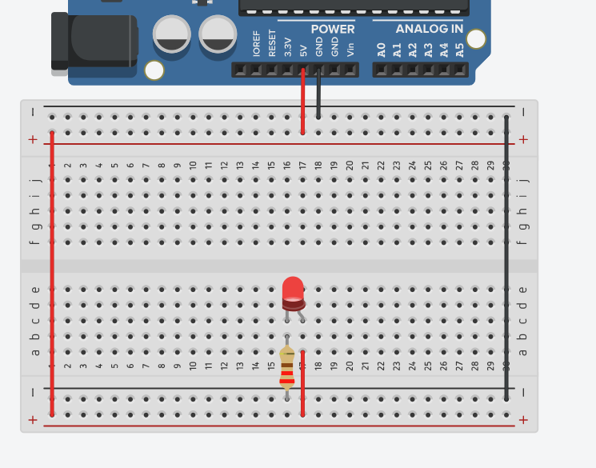
</div>

- ### Led con arduino programado:
  A continuación se muestra la conexión de un led con Arduino y el código utilizado para encender el led por un segundo y apagarlo por un segundo igual:
<div style="display: flex; justify-content: center;">
  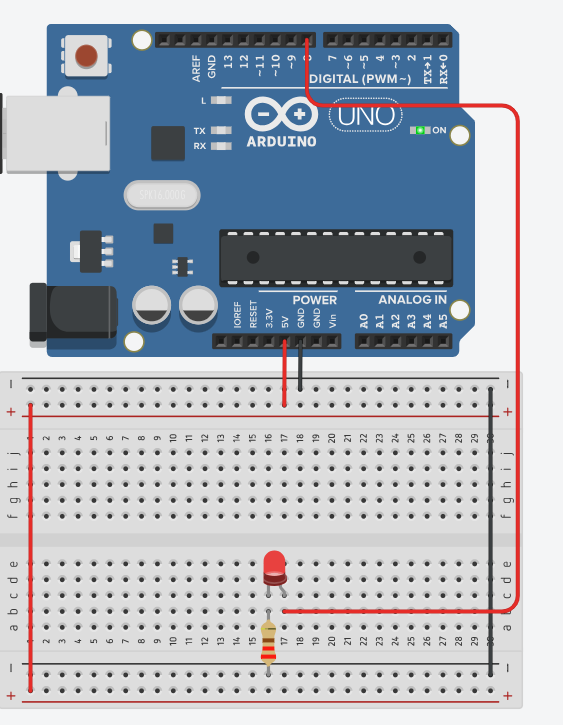
</div>
<div style="display: flex; justify-content: center;">
  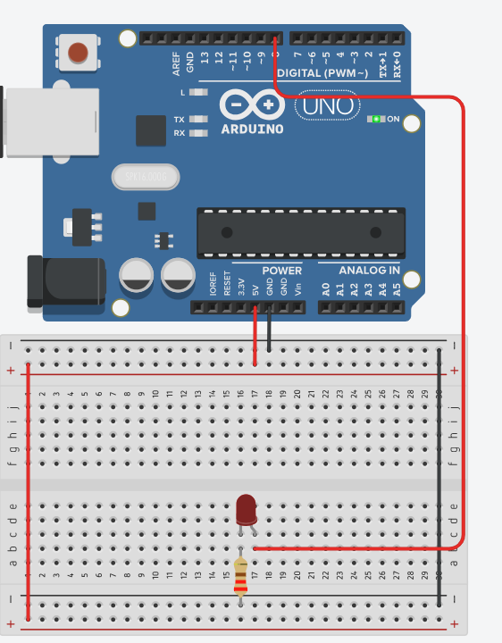
</div>

<br/>

```arduino
void setup() // Esta función se ejecuta una sola vez
{
  pinMode(8, OUTPUT); // Pin 8 en modo salida
  digitalWrite(8, LOW); // Iniciar el pin 8 en estado apagado
}

void loop() // Esta funcion se ejecuta infinitamente
{
  digitalWrite(8, HIGH); // Escritura digital para encender el led el cual está en el pin 8
  delay(1000); // Wait for 1000 millisecond(s) = 1s
  digitalWrite(8, LOW);// Escritura digital para apagar el led el cual está en el pin 8
  delay(1000); // Wait for 1000 millisecond(s) = 1s
}
```

## <a name="buzzer">CONEXIÓN CON UN BUZZER</a>

Para comenzar se vio cuál es la conexión de un buzzer, se mostró haciendo uso del arduino como fuente de poder y cómo controlar un buzzer por medio de arduino y el código que se compila:

- ### Buzzer con arduino como fuente de poder:
  A continuación se muestra la conexión básica de un buzzer:
<div style="display: flex; justify-content: center;">
  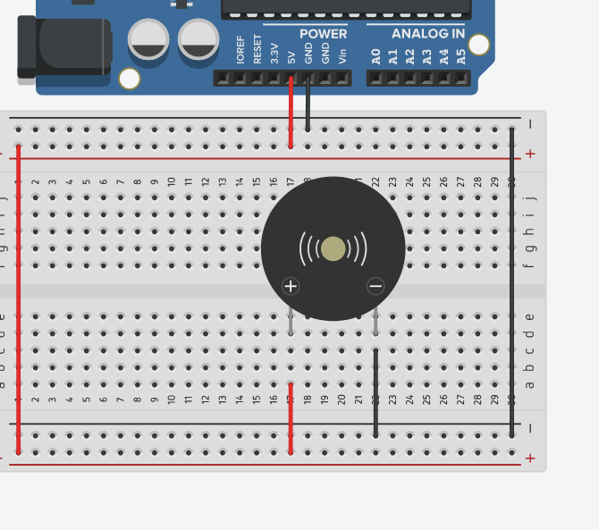
</div>

- ### Buzzer con arduino programado:
  A continuación se muestra la conexión de un buzzer con Arduino y el código utilizado para encender el buzzer por un segundo y apagarlo por un segundo igual:
<div style="display: flex; justify-content: center;">
  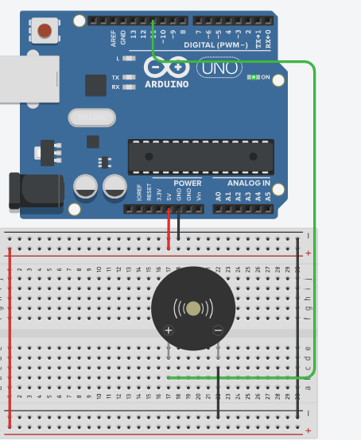
</div>
<div style="display: flex; justify-content: center;">
  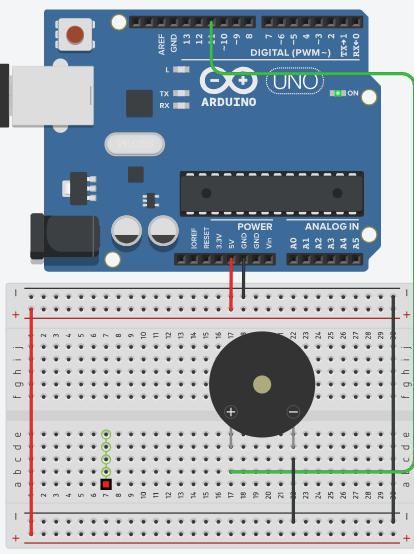
</div>

<br/>

```arduino
#define buzzer 11 // Forma de definir variables para pines
// const int buzzer = 11; Otra forma de variables para pines
void setup()
{
  pinMode(buzzer, OUTPUT); // Buzzer en modo salida
  digitalWrite(buzzer, LOW);
}

void loop()
{
  digitalWrite(buzzer, HIGH); // Escritura digital para encender el buzzer
  delay(1000); // Wait for 1000 millisecond(s)
  digitalWrite(buzzer, LOW); // Escritura digital para apagar el buzzer
  delay(1000); // Wait for 1000 millisecond(s)
}
```
<b>Nota = El manejo del sonido de un buzzer se puede manejar por frecuencias como se puede ver en esta página:</b>
<a href="https://inputmakers.com/componentes/melodia-de-star-wars-con-arduino-y-zumbador">Melodía Star Wars</a>


## <a name="rgb">CONEXIÓN LED RGB Y BUTTONS</a>

Para comenzar se vio cuál es la conexión de un RGB y un button, se mostró haciendo uso del arduino como fuente de poder y cómo controlar un RGB y un button por medio de arduino y el código que se compila:

- ### RGB y Button con arduino como fuente de poder:
  A continuación se muestra la conexión básica de un RGB y un button:
<div style="display: flex; justify-content: center;">
  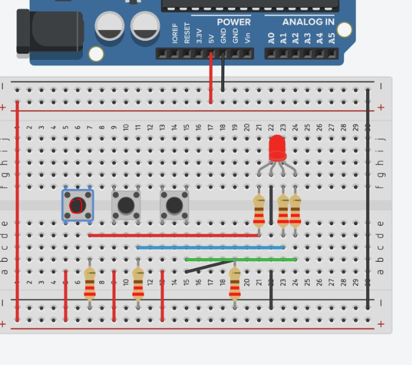
</div>
<div style="display: flex; justify-content: center;">
  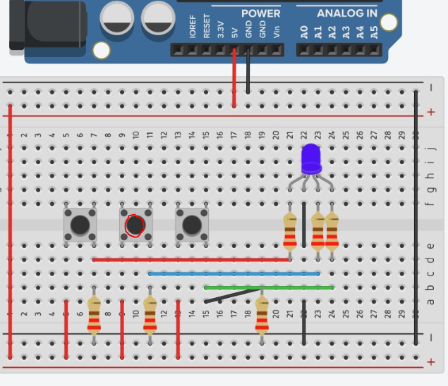
</div>
<div style="display: flex; justify-content: center;">
  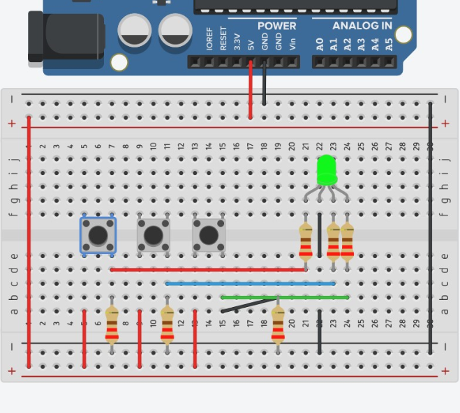
</div>

- ### RGB y Button con arduino programado:
  A continuación se muestra la conexión de un RGB y un button con Arduino y el código utilizado para encender el RGB por medio de un button:
<div style="display: flex; justify-content: center;">
  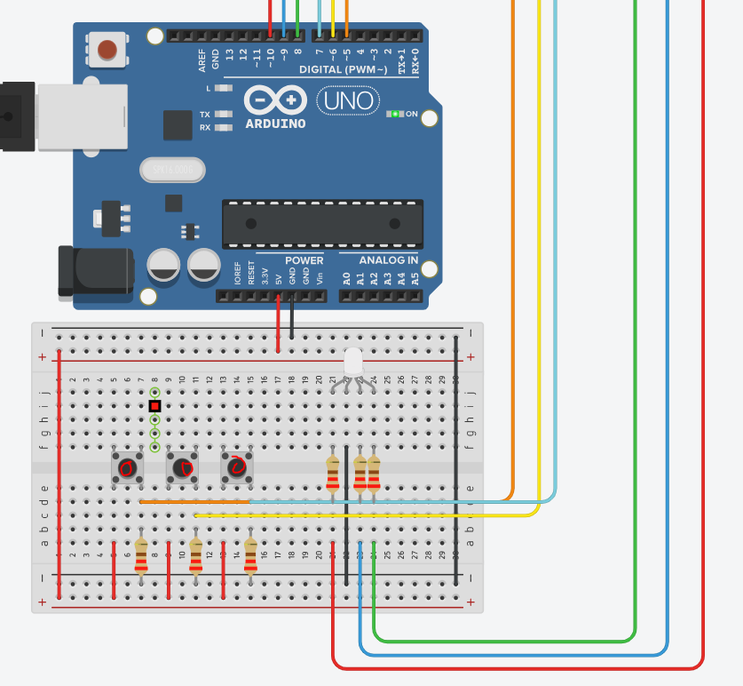
</div>
<div style="display: flex; justify-content: center;">
  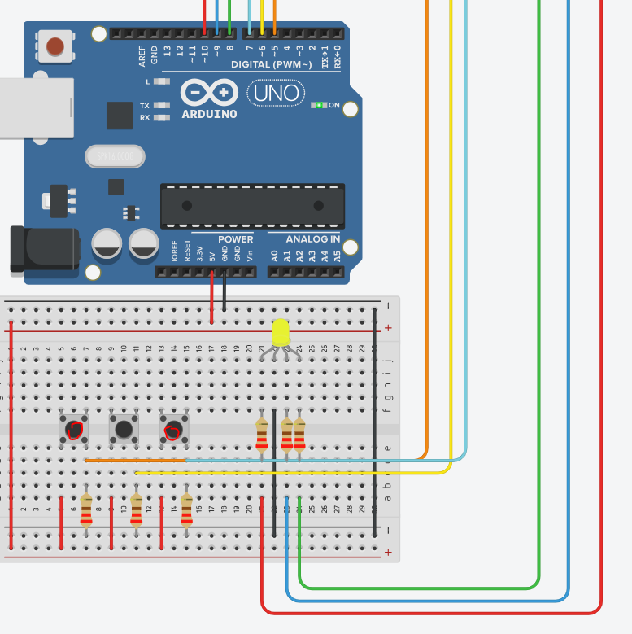
</div>

<br/>

```arduino
#define green 8 // Pin led verde
#define blue 9 // Pin led azul
#define red 10 // Pin led rojo
#define btn1 5 // Pin led button 1
#define btn2 6 // Pin led button 2
#define btn3 7 // Pin led button 3

// Los estados declarados nos ayudarán a que cuando se presione una vez el button se prenda el led y si se vuelve presionar se apague, esto para no dejarlo presionado.
bool estado1 = false; // Estado led red
bool estado2 = false; // Estado led blue
bool estado3 = false; // Estado led green

void setup()
{
  // Ponemos los pines del arduino que se conectan a los leds en modo salida.
  pinMode(green, OUTPUT);
  pinMode(blue, OUTPUT);
  pinMode(red, OUTPUT);

  // Inicialmente iniciamos con los leds apagados.
  digitalWrite(green, LOW);
  digitalWrite(blue, LOW);
  digitalWrite(red, LOW);

  // Ponemos los pines del arduino que se conectan a los buttons en modo entrada (Ya que reciben el pulso).
  pinMode(btn1, INPUT);
  pinMode(btn2, INPUT);
  pinMode(btn3, INPUT);
}

void loop()
{
  // Validar si el button 1 se presiona
  if(digitalRead(btn1)== HIGH){
    // Cambiar el estado de false a true o de true a false
    estado1 = !estado1;
    delay(100);
  }

  if(estado1){
    // Si estado1 = true, entonces encendemos el led rojo
    digitalWrite(red, HIGH);
  } else{
    // Si estado1 = false, entonces apagamos el led rojo
    digitalWrite(red, LOW);
  }

  // Validar si el button 2 se presiona
  if(digitalRead(btn2)== HIGH){
    // Cambiar el estado de false a true o de true a false
    estado2 = !estado2;
    delay(100);
  }

  if(estado2){
    // Si estado2 = true, entonces encendemos el led blue
    digitalWrite(blue, HIGH);
  } else{
    // Si estado2 = false, entonces apagamos el led blue
    digitalWrite(blue, LOW);
  }

  // Validar si el button 3 se presiona
  if(digitalRead(btn3)== HIGH){
    // Cambiar el estado de false a true o de true a false
    estado3 = !estado3;
    delay(100);
  }

  if(estado3){
    // Si estado3 = true, entonces encendemos el led green
    digitalWrite(green, HIGH);
  } else{
    // Si estado3 = false, entonces apagamos el led green
    digitalWrite(green, LOW);
  }

}
```

## <a name="pot">CONEXIÓN LED Y POTENCIÓMETRO</a>

Para comenzar se vio cuál es la conexión de un led y un potenciómetro, se mostró haciendo uso del arduino como fuente de poder y cómo controlar un led y un potenciómetro por medio de arduino y el código que se compila:

- ### LED y Potenciómetro con arduino como fuente de poder:
  A continuación se muestra la conexión básica de un led y un potenciómetro:
<div style="display: flex; justify-content: center;">
  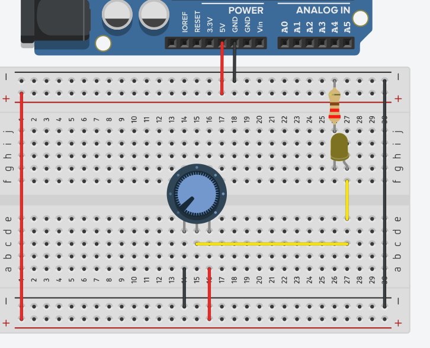
</div>
<div style="display: flex; justify-content: center;">
  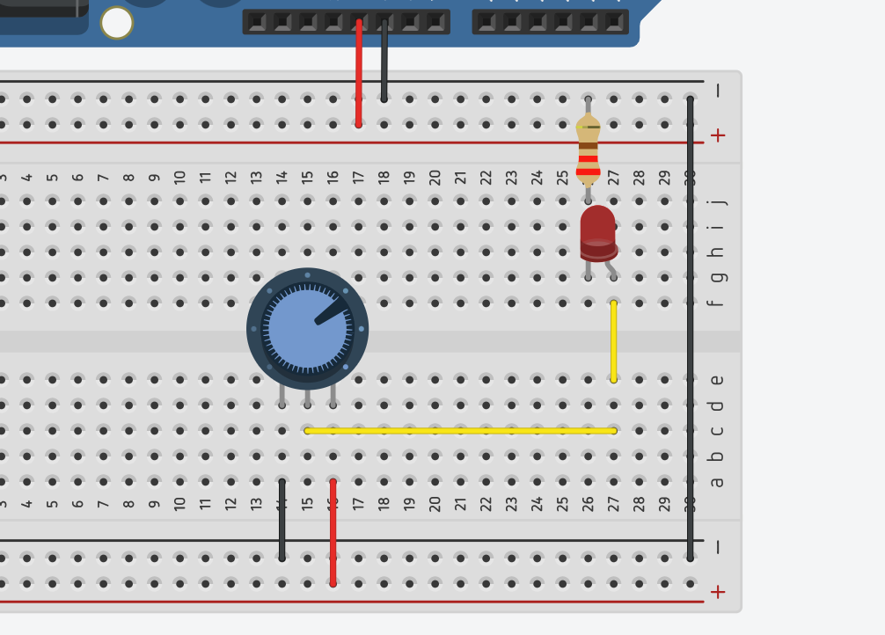
</div>
<div style="display: flex; justify-content: center;">
  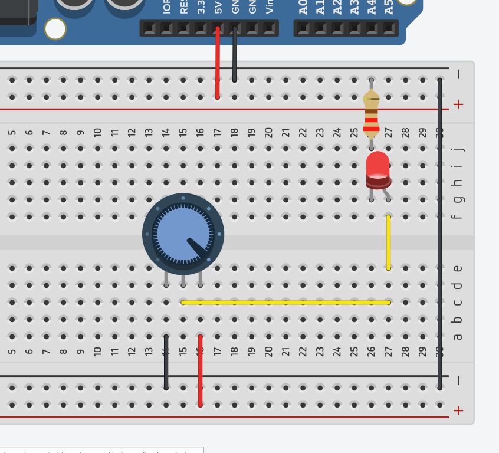
</div>

- ### LED y Potenciómetro con arduino programado:
  A continuación se muestra la conexión de un led y un potenciómetro con Arduino y el código utilizado para encender el LED por medio del valor que nos retorne el potenciómetro:
<div style="display: flex; justify-content: center;">
  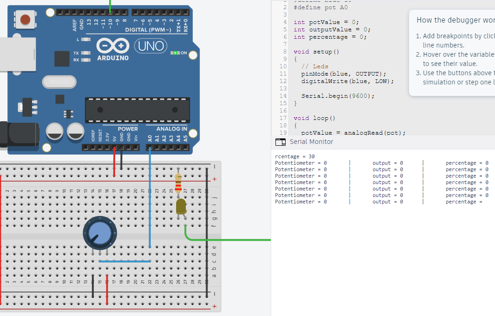
</div>
<div style="display: flex; justify-content: center;">
  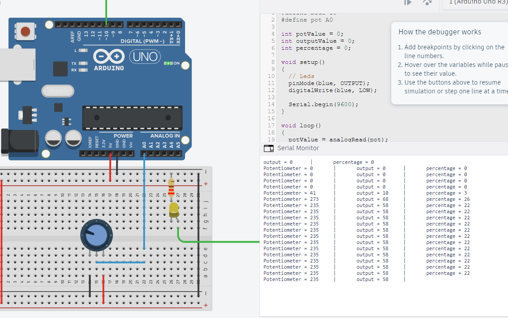
</div>
<div style="display: flex; justify-content: center;">
  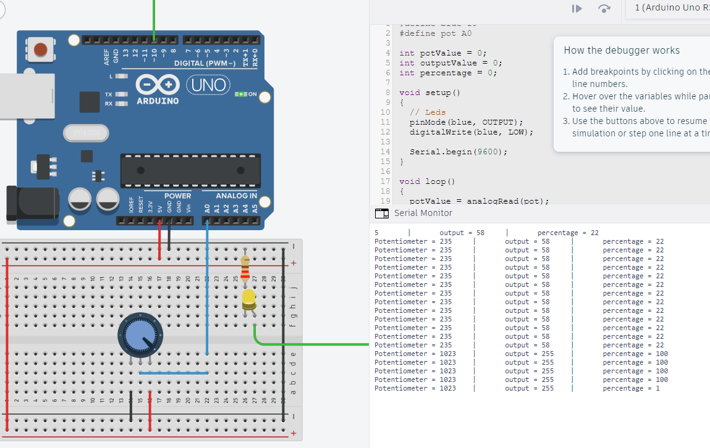
</div>

<br/>

```arduino
#define yellow 10 // Pin led amarillo
#define pot A0 // Pin potenciometro

int potValue = 0; // Valor que retorna el potenciometro
int outputValue = 0; // Valor mapeado para el rango del led
int percentage = 0; // Porcentaje de encendido del led

void setup()
{
  pinMode(yellow, OUTPUT); // Pin Led amarrilo en modo salida
  digitalWrite(yellow, LOW); // Iniciar el led amarillo apagado

  Serial.begin(9600); // Iniciamos el modo serial para imprimir en consola
}

void loop()
{
  potValue = analogRead(pot); // Obtnemos lectura analógica del potenciómetro
  outputValue = map(potValue, 0, 1023, 0, 255); // Mapeamos el valor del potenciómetro al rango analógico del led
  percentage = map(outputValue, 0, 255, 0, 100); // Mapeamos el valor que está en el rango analógico del led y lo convertimos en porcentaje

  analogWrite(yellow, outputValue); // Encendemos el led de acuerdo al valor analógico dentro del rango del led

  // Imprimimos en el monitor serial los valores
  Serial.print("Potentiometer = " ); 
  Serial.print(potValue); 
  Serial.print("\t|\toutput = "); 
  Serial.print(outputValue);
  Serial.print("\t|\tpercentage = "); 
  Serial.println(percentage);

  delay(2); 
}
```