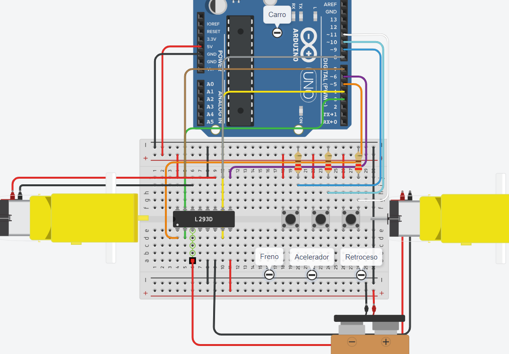

## UNIVERSIDAD DE SAN CARLOS DE GUATEMALA 
## INGENIERÍA EN CIENCIAS Y SISTEMAS
## PRÁCTICAS INTERMEDIAS
## TUTORES: 
- ## JOSUÉ RODOLFO MORALES CASTILLO - 202010033
- ## AYESER CRISTIÁN OXLAJ JUÁREZ - 202010025
- ## OWARD FRANCISCO ALBERÍ SIAN SOLIS - 201901807

<br/>

# CLASE 2 - INTRODUCCIÓN A MOTORES Y SENSORES USANDO ARDUINO

## ÍNDICE
- [CONEXIÓN DE MOTORES Y PUENTE H](#hbridge)
- [CONEXIÓN DE SENSORES](#sensors)

## <a name="hbridge">CONEXIÓN DE MOTORES Y PUENTE H</a>

Para comenzar hay que ver para qué sirve cada pin del puente H:
<div style="display: flex; justify-content: center;">
  
</div>

Los pines que dicen Enable serán los que conectaremos a pines del arduino de tipo pwm, ya que en estos pines indicaremos la velocidad que queremos que tengan nuestros motores, considerando que el rango que les debemos mandar es de 0 a 255.

También podemos observar los pines que dicen Input, esos pines pueden ir conectados a pines digitales del arduino, ya que solamente debemos mandarles un HIGH o LOS, algo importante a tomar en cuenta es que cada lado del puente h es para controlar un motor, como máximo con uno de estos módulos podemos controlar 2 motores, entonces si quermos que nuestro motor funcione en un sentido le mandaremos por ejemplo un estado HIGH al INPUT1 y al INPUT2 debemos mandarle un LOW, o si queremos que gire en sentido inverso, le mandaremos un estado HIGH al INPUT2 y un LOW al INTPU1. Lo mismo pasaría con el Input3 e Input4.

Además contamos con los pines que se llaman Output los cuales van relacionados con su respectivo Input, estos pines llamados Output serán los que conectaremos a los pines del motor, por ejemplo podemos conectar el Output_1 al pin positivo del motor y el Output_2 al pin negativo o al revés, lo único que afectaría sería la polaridad o dicho en otras palabras el sentido en que giran los motores.

Luego podemos observar los pines que dicen GND, estos irán conectados a tierra, solamente es necesario conectar 1, pero si vemos que se genera mucho calor, entonces se recomienda conectar más pines que dicen GND a tierra.

Por último tenemos los pines de alimentación, el primero que dice VCC_1 es donde conectaremos 5V ya que estos es lo que se requiere para alimentar este módulo, ahora el VCC_2 será como una fuente externa, donde le daremos el voltaje para alimentar a nuestros motores, se recomienda leer el rango de voltaje que acepta este pin.

A continuación se muestra la conexión final que se hizo con los motores, el puente H y los pines del arduino.
<div style="display: flex; justify-content: center;">
  
</div>


- ### Código usado para el funcinamiento del carro simulado:

```arduino
// Pines velocidad motores
#define PINO_ENA 5 
#define PINO_ENB 6

// Pines sentido de motores
#define PINO_IN1 3 
#define PINO_IN2 4
#define PINO_IN3 8
#define PINO_IN4 7

// Botones (Acelerador, freno, retroceso)
#define btn1 10
#define btn2 9
#define btn3 11

// Controla el aumento o disminución de velocidad que se le manda al puente H
int i = 0;

// Tiempo en ms para los delay
const int TEMPO_ESPERA = 500;

// Banderas que nos ayudan a controlar los estados de los buttons
bool estado1 = false;
bool estado2 = false;
bool estado3 = false;

void setup() {
// Pines en modo salida
pinMode(PINO_ENA, OUTPUT); 
pinMode(PINO_ENB, OUTPUT);
pinMode(PINO_IN1, OUTPUT);
pinMode(PINO_IN2, OUTPUT);
pinMode(PINO_IN3, OUTPUT);
pinMode(PINO_IN4, OUTPUT);

// Pines en modo entrada
pinMode(btn1, INPUT);
pinMode(btn2, INPUT);
pinMode(btn3, INPUT);

// Iniciar con los motores apagados y velocidad 0
digitalWrite(PINO_IN1, LOW); 
digitalWrite(PINO_IN2, LOW);
digitalWrite(PINO_IN3, LOW);
digitalWrite(PINO_IN4, LOW);
digitalWrite(PINO_ENA, LOW);
digitalWrite(PINO_ENB, LOW);

// Inicio monitor serial
Serial.begin(9600);
}

void loop() {
// Acelerador - se valida si el btn1 es presionado
if(digitalRead(btn1)== HIGH){
    // Cambiamos los estados para que si estado1 es true entonces que solo funcione el if que valida si este mismo es verdadero
    estado1 = !estado1;
    estado2 = false;
    estado3 = false;
    
    //Imprimimos el estado para ver su valor actual
    Serial.print("Estado 1: ");
    Serial.println(estado1);
    delay(300);
};

if(estado1){
    // FORWARD
    // Se le manda el estaod HIGH o LOW por medio de escritura digital a los pines Input del puente H, para indicarle el sentido en que deben girar los motores
    digitalWrite(PINO_IN1, LOW); 
    digitalWrite(PINO_IN2, HIGH);
    digitalWrite(PINO_IN3, LOW);
    digitalWrite(PINO_IN4, HIGH);

    // Se aumenta la velocidad de los motres de 15 en 15 hasta llegar a 255
    if(i < 255){
    i += 15;
    }

    // Se realiza una escritura analógica al respectivo pin enable del puente h, para indicar la velocidad que debe tener el motor
    analogWrite(PINO_ENA, i);
    analogWrite(PINO_ENB, i);
    delay(TEMPO_ESPERA);
}


// Freno - se valida si el btn2 es presionado
if(digitalRead(btn2)== HIGH){
    // Cambiamos los estados para que si estado2 es true entonces que solo funcione el if que valida si este mismo es verdadero
    estado2 = !estado2;
    estado1 = false;
    estado3 = false;

    //Imprimimos el estado para ver su valor actual
    Serial.print("Estado 2: ");
    Serial.println(estado2);
    delay(300);
};

if(estado2){
    // Stop
    // Se disminuye la velocidad de los motres de 15 en 15 hasta llegar a 0
    if(i > 0){
    i -= 15;
    }

    // Se realiza una escritura analógica al respectivo pin enable del puente h, para indicar la velocidad que debe tener el motor
    analogWrite(PINO_ENA, i);
    analogWrite(PINO_ENB, i);
    delay(TEMPO_ESPERA);
}


// Retroceso - se valida si el btn3 es presionado
if(digitalRead(btn3)== HIGH){
    // Cambiamos los estados para que si estado3 es true entonces que solo funcione el if que valida si este mismo es verdadero
    estado3 = !estado3;
    estado1 = false;
    estado2 = false;

    //Imprimimos el estado para ver su valor actual
    Serial.print("Estado 3: ");
    Serial.println(estado3);
    delay(300);
};

if(estado3){
    // BACKWARD
    // Se le manda el estaod HIGH o LOW por medio de escritura digital a los pines Input del puente H, para indicarle el sentido en que deben girar los motores
    digitalWrite(PINO_IN1, HIGH); 
    digitalWrite(PINO_IN2, LOW);
    digitalWrite(PINO_IN3, HIGH);
    digitalWrite(PINO_IN4, LOW);

    // Se aumenta la velocidad de los motres de 15 en 15 hasta llegar a 255
    if(i < 255){
    i += 15;
    }

    // Se realiza una escritura analógica al respectivo pin enable del puente h, para indicar la velocidad que debe tener el motor
    analogWrite(PINO_ENA, i);
    analogWrite(PINO_ENB, i);
    delay(TEMPO_ESPERA);
}

}
```

Una vez le hemos colocado el código al arduino observaremos lo siguientes resultados:
<div style="display: flex; justify-content: center;">
  
</div>
<div style="display: flex; justify-content: center;">
  
</div>

## <a name="sensors">CONEXIÓN DE SENSORES</a>

Para la simulación de la garita se utilizaron los siguientes componentes y sus respectivas conexiones:
<div style="display: flex; justify-content: center;">
  
</div>

En este caso se debe conectar el servomotor a un pwm para controlar el ángulo y para las conexiones del sensor ultrasónico solo con pines digitales es suficiente, ya que estos solo necesitan una señal, o en otras palabras una escritura digital como un HIGH para que funcionen.

- ### Código usado para el funcinamiento de la garita simulada:

```arduino
// Importación de la librería Servo, para controlar nuestro servomotor
#include <Servo.h>

// Definición de los pines par anuestros leds, button, servomotor y los pines del ultrasónico.
#define red 5
#define yellow 6
#define green 7
#define talanquera 9
#define Trigger 13
#define Echo 12
#define btn1 4

// Se crea una instancia del servomotor
Servo servoMotor;

// Bandera para controlar el estado de la talanquera y leds por medio del button
bool estado1 = false;

void setup() {
    // Inicializamos el monitor serial
    Serial.begin(9600);

    // Le indicamos a la instancia del servomotor el pin en el que va a funcionar
    servoMotor.attach(talanquera);

    // Indicamos los pines que seran de tipo salida
    pinMode(Trigger, OUTPUT);
    pinMode(red, OUTPUT);
    pinMode(yellow, OUTPUT);
    pinMode(green, OUTPUT);

    // Indicamos los pines que seran de tipo entrada
    pinMode(Echo, INPUT);
    pinMode(btn1, INPUT);

    // Inicializamos con un ángulo de 90 grados con el servomotor para simular que la talanquera está cerrada y encendemos el led rojo indicando que no hay paso
    servoMotor.write(90);
    digitalWrite(Trigger, LOW);
    digitalWrite(red, HIGH);
}

void loop() {
    // Declaramos la variables que se usan para guardar los valores que retorne el ultrasónico
    long t;
    long d;

    // Validamos si el button es presionado
    if(digitalRead(btn1) == HIGH){
        // Cambiamos el valor del estado, negandolo.
        estado1 = !estado1;

        // Imprimimos el valor actual del estado
        Serial.print("Estado: ");
        Serial.println(estado1);
    }

    if(estado1){
        // Si el estado es verdadero procedemos a levantar la talanquera, moviendo el ángulo del servomotor a 180 grados, encendemos el led verde indicando que hay paso y apagamos el led rojo
        servoMotor.write(180);
        delay(100);
        digitalWrite(green, HIGH);
        digitalWrite(red, LOW);
    } else{
        // Si el estado es falso procedemos a bajar la talanquera, moviendo el ángulo del servomotor a 90 grados, encendemos el led rojo indicando que no hay paso y apagamos el led verde
        servoMotor.write(90);
        digitalWrite(green, LOW);
        digitalWrite(red, HIGH);
        delay(100);
    }


    // Mandamos las ondas de sonido con el ultrasónico haciendo una escritura digital con estado HIGH en el pin del trigger y luego del pequeño tiempo que realiza eso, procedemos a apagar el trigger.
    digitalWrite(Trigger, HIGH);
    delayMicroseconds(10);
    digitalWrite(Trigger, LOW);

    // Recibimos las ondas mandadas en el pin Echo para obtener el tiempo que tardaron
    t = pulseIn(Echo, HIGH);
    
    // Aplicamos esta fórmula para obtener la distancia en cm
    d = t/58;

    // Imprimimos los resultados que obtuvimos
    Serial.print("Distancia: ");
    Serial.print(d);
    Serial.println();
    delay(100);

    // Validamos si la distancia es menor a 2 cm, entonces prendemos nuestro led de warning que sería el amarillo, de lo contrario lo apagaremos.
    if(d < 200){
        digitalWrite(yellow, 1);
    }else{
        digitalWrite(yellow, 0);
    }

}
```

Una vez le hemos colocado el código al arduino observaremos lo siguientes resultados:
<div style="display: flex; justify-content: center;">
  
</div>

<br/>

<div style="display: flex; justify-content: center;">
  
</div>

<br/>

<div style="display: flex; justify-content: center;">
  
</div>

<br/>

<div style="display: flex; justify-content: center;">
  
</div>